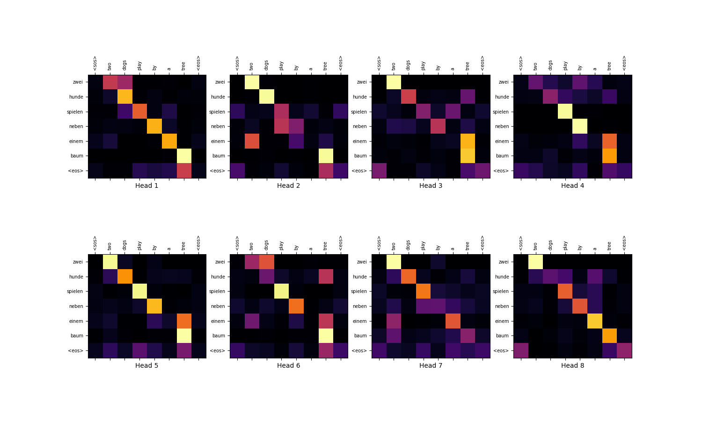
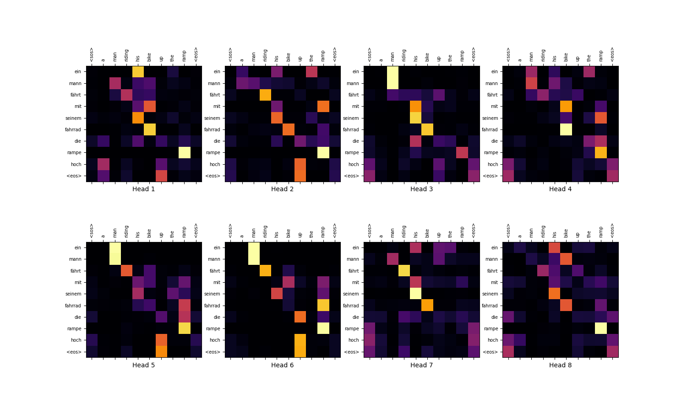
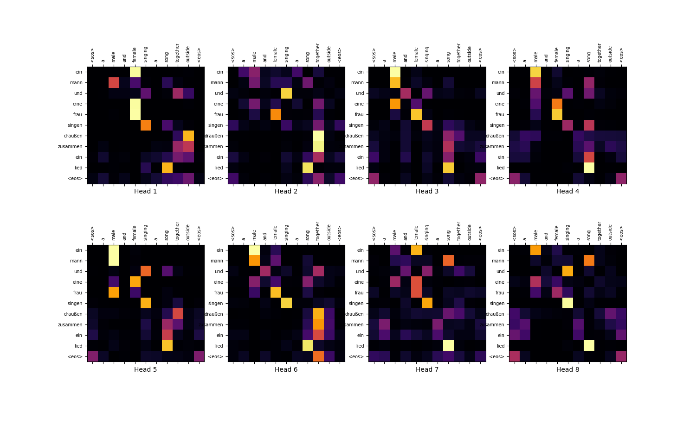

# numpy-transformer
## What it is?
This is a numpy implementation of the Transformer (Seq2Seq) model in original paper "Attention is All You Need", that runs at CPU with numpy or GPU with cupy (very fast).

Some methods were borrowed from my [numpy-nn-model](https://github.com/AkiRusProd/numpy-nn-model) repository.

## Training
Since the model is implemented at numpy, it runs on the CPU. Therefore, I have to set more gentle conditions for training the model. Otherwise CPU training will take **hundreds or thousands of hours**

The model was trained for 10 epochs. On my machine, training one epoch with CPU takes 8 hours, **but with GPU takes 2 minutes!!!! Thus training of all epochs takes 20 minutes**.

### Dataset:
The dataset on which the model was trained is [Multi30k](https://pytorchnlp.readthedocs.io/en/latest/_modules/torchnlp/datasets/multi30k.html) dataset.
To import this just run [extract_data.py](extract_data.py) script.

## Project Structure
#### Transformer model components:  
 - [transformer.py](transformer/transformer.py) - initializes and trains the model. Also here the model predicts sequences  
 - [encoder.py](transformer/modules/encoder.py) and [decoder.py](transformer/modules/decoder.py) - modules that make up the this Seq2Seq model  
 - [base layers](transformer/layers/base) - simple neural network layers like Dense, Dropout etc
 - [combined layers](transformer/layers/combined) - special transformer layers
#### Functional components:
 - [activations.py](transformer/activations.py) - list of activation functions for the model
 - [losses.py](transformer/losses.py) - list of loss functions for the model. But used only torch like Cross Entropy Loss
 - [optimizers.py](transformer/optimizers.py) - list of gradient optimizers for the model. In this case, Adam is used with the Noam scheduler
#### Special utils:
 - [extract_data.py](extract_data.py) - downloads and extracts dataset
 - [prepare_data.py](transformer/prepare_data.py) - import the data in a suitable form for the transformer
#### Others:
 - ~~[tests](transformer/tests) - junk scripts. Do not pay attention to them~~

## Examples
#### Examples of translated sentences of validation set:  

>Example №1  
*Input sentence: people sitting in a circle outside a large building  
Decoded sentence: personen sitzen im freien vor einem großen gebäude <eos>  
Target sentence: menschen die vor einem großen gebäude im kreis sitzen*  

>Example №2  
Input sentence: a woman sings in a club with a guitarist behind her  
Decoded sentence: eine frau singt in einem club mit einem club <eos>  
Target sentence: eine frau singt in einem klub mit einem gitarristen hinter ihr*  

>Example №3  
*Input sentence: construction workers having a discussion by the tracks  
Decoded sentence: bauarbeiter diskutieren einige von den bahngleisen <eos>  
Target sentence: arbeiter diskutieren neben den schiene*  

>Example №4  
*Input sentence: a man with graying hair shaves his beard  
Decoded sentence: ein bärtiger mann <unk> bart trägt <unk> <eos>  
Target sentence: ein mann mit ergrauenden haaren rasiert seinen bart*  

>Example №5  
*Input sentence: a man in a black shirt and jeans standing on the sidewalk looking at the camera  
Decoded sentence: ein mann in einem schwarzen oberteil und jeans steht auf dem gehweg und blickt auf die kamera <eos>  
Target sentence: ein mann in einem schwarzen hemd und jeans steht auf dem gehsteig und blickt in die kamera*  

>Example №6  
*Input sentence: a woman is laying down on a sofa laughing  
Decoded sentence: eine frau liegt auf einem sofa und lacht <eos>  
Target sentence: eine frau liegt auf einem sofa und lacht*  

>Example №7  
Input sentence: two males seem to be conversing while standing in front of a truck's back and behind a metal item while four people stand around them  
Decoded sentence: vier personen stehen hinter ihnen unterhalten sich während hinter ihnen <unk> und hinter ihnen unterhalten und unterhalten und hinter ihnen stehen <eos>  
Target sentence: zwei männer stehen vor dem heck eines lasters und hinter einem metallgegenstand und unterhalten sich anscheinend während vier weitere personen um sie herum stehen*  

>Example №8  
*Input sentence: two rockers are singing and playing on a dark stage  
Decoded sentence: zwei <unk> singen und spielen auf einer bühne <eos>  
Target sentence: zwei rocker singen und spielen auf einer dunklen bühne*  

>Example №9  
*Input sentence: a man fixing a little girl's bicycle  
Decoded sentence: ein mann repariert ein kleines fahrrad <eos>  
Target sentence: ein mann repariert das fahrrad eines kleinen mädchens*  

>Example №10  
*Input sentence: a man eating a sandwich with his baby daughter in his lap  
Decoded sentence: ein mann isst ein baby auf seiner tochter ein sandwich <eos>  
Target sentence: ein mann isst ein sandwich und hält seine kleine tochter auf dem schoß*  

#### Attention plots:

### References:
 - https://arxiv.org/abs/1706.03762 - article "Attention is All You Need"

### TODO:
1) ~~add pretrained model (very soon)~~
2) clean up and refactor code
3) ~~add cupy realization (under development)~~
4) add more power pretrained model (very soon)
